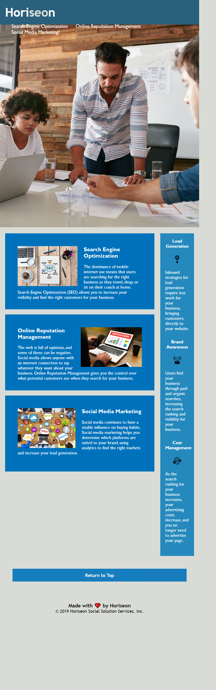

#html-css challenge: Horiseon Solution Services Inc.

## Description

The motivation behind building and deploying this webpage is to refactor code including html and css best practices. 
This excercise also pushes the boundaries of classroom curriculum and ignites a better understanding 
of these programming languages. The refactoring included shortening style classes for brevity, changing most div 
(at top and sub levels) to sections, and repairing link from top tab to relevant in-page section. A new functionality 
has also been added to aid users easily return to top of page.

## Installation

Visit the live website [enwokedi96.github.io/horiseon-solutions](here).

## Usage

The screenshot of the webpage can be visualised here: 
    
## License

The last section of a high-quality README file is the license. This lets other developers know what they can and cannot do with your project. If you need help choosing a license, refer to [https://choosealicense.com/](https://choosealicense.com/).

## Features

### HORISEON SOCIAL SOLUTION SERVICES, INC.

Here at Horiseon, we provide state of the art solutions to businesses and organisations seeking global presence. 
We achieve this through our diverse service offerings, such as Search Engine Optimizaton (SEO), online reputation management and social media marketing. 
For more information on our services and the accrued benefits, do visit our website. We look forward to hearing from you. 
